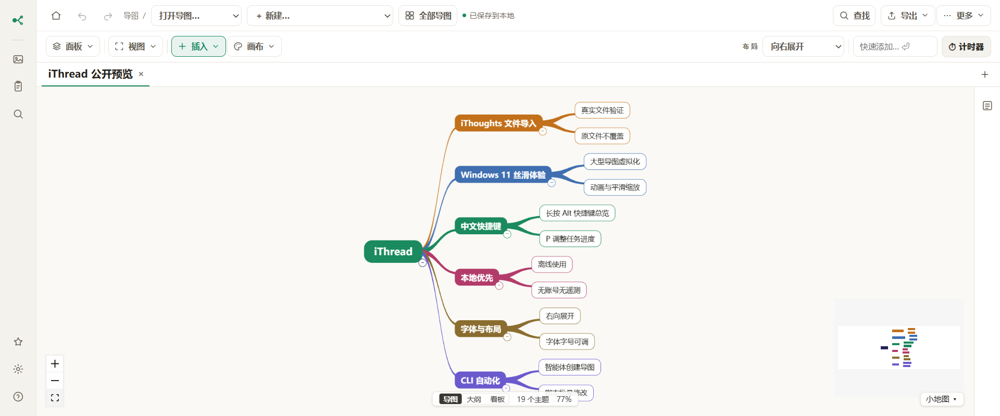

# iThread 中文说明

**简体中文 | [English](README.en.md)**

**当前公开测试版：v0.6.1** · 面向 Windows 11 · 本地优先 · Apache-2.0

> iThread 是独立社区项目，与 iThoughts 及其原作者不存在隶属、授权或背书关系。

[在线体验](https://kidultank.github.io/iThread/) ·
[下载 Windows 版](https://github.com/KIDULTANK/iThread/releases) ·
[快速上手](docs/QUICKSTART.zh-CN.md) ·
[已知限制](docs/KNOWN_LIMITATIONS.zh-CN.md) ·
[CLI 控制桥](docs/CLI.md) ·
[问题反馈](https://github.com/KIDULTANK/iThread/issues/new/choose)



## 项目简介

iThread 是一款面向 Windows 11 的本地优先思维导图应用，重点兼容 iThoughts `.itmz` 文件，
提供流畅的大型导图浏览、键盘操作、中英文界面和可供脚本或智能体调用的本地 CLI。应用无需
账号、没有遥测，也不要求持续联网；导图默认保存在本机。

项目源自 Dann Bleeker Pedersen 的
[MindMap Studio](https://github.com/dannbleeker/mindmap-studio)，遵循 Apache License 2.0，
并保留了上游版权及许可声明。

## Windows 版下载

请从 [Releases](https://github.com/KIDULTANK/iThread/releases) 下载以下任一版本：

- `iThread-*-Windows-x64-Setup.exe`：安装版，可注册支持的文件类型；
- `iThread-*-Windows-x64-Portable.exe`：免安装便携版，不修改系统文件关联。

当前社区构建尚未完成代码签名，Windows SmartScreen 可能显示“未知发布者”。请确认下载地址，
并与发布页中的 `SHA256SUMS.txt` 核对校验值。

## iThoughts 文件兼容

iThread 可以导入 iThoughts `.itmz`，也可以把修改结果导出为新的 iThoughts 兼容 `.itmz`，
不会覆盖源文件。建议：

1. 首次测试时保留原始 `.itmz`；
2. 日常编辑使用无损原生格式 `.ithread`；
3. 需要回到 iThoughts 时使用“导出 → `.itmz`”；
4. 对复杂样式、附件和大型导图抽查关键内容。

旧版 iThread 的 `.mmst` 文件仍可无损读取。

## 主要功能

- 向右、向左、双侧、组织结构图、时间线、鱼骨图、矩阵等多种布局；
- 键盘优先的主题创建、编辑、移动、折叠和任务进度操作；
- Markdown 层级导入及主题加粗、斜体、下划线、高亮；
- 备注、链接、附件、标签、标记、优先级、日期和进度；
- 大纲、搜索替换、筛选、聚焦分支、看板、演示和版本历史；
- `.itmz`、`.ithread`、Markdown、XMind、FreeMind、OPML、MindManager 等格式；
- 本地 CLI，可批量创建、读取和修改正在运行的导图；
- 中英文界面、离线使用、本地自动保存和异常恢复草稿。

## 快捷键摘要

- `Enter`：结束编辑；未处于编辑状态时创建同级主题；
- `Tab`：创建下级主题；
- `F2` 或 `Ctrl+Enter`：编辑选中主题；
- `Alt+方向键`：移动主题或分支；
- `P` / `Shift+P`：增加或减少任务进度；
- 长按 `Alt`：显示快捷键总览。

## 数据与隐私

iThread 没有账号和遥测，不会在后台上传导图内容。浏览器版数据位于浏览器本地存储，Windows
桌面版可把 `.ithread` 保存到用户选择的位置。项目目前没有自建云同步；可以使用 OneDrive、
Dropbox、坚果云等系统同步目录保存原生文件。

公开反馈问题时，请勿上传包含个人信息、案件材料、客户资料或商业秘密的原始导图。

## 开发与贡献

项目需要 Node.js 22+ 和 pnpm 11：

```powershell
pnpm install --frozen-lockfile
pnpm gate
pnpm desktop:dist
```

欢迎提交可复现的问题、脱敏兼容样本和范围明确的 Pull Request。详情见
[中文贡献指南](CONTRIBUTING.zh-CN.md)。
